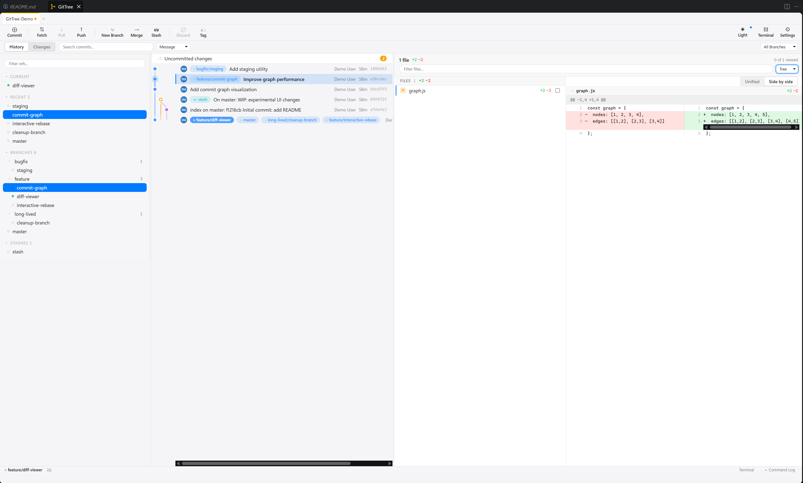
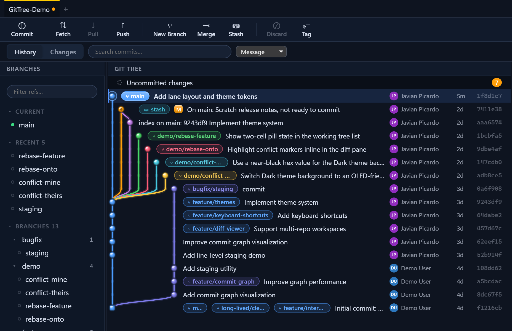
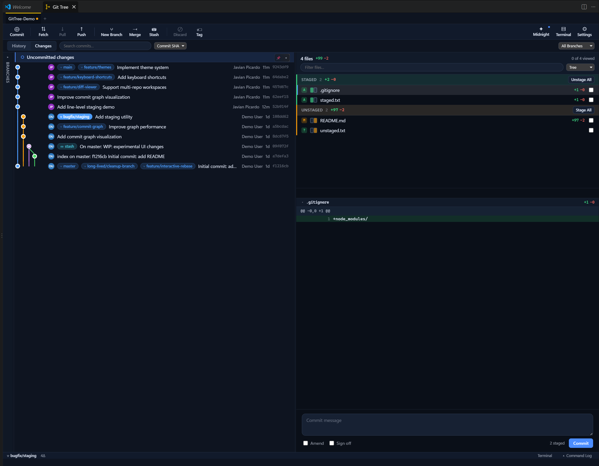
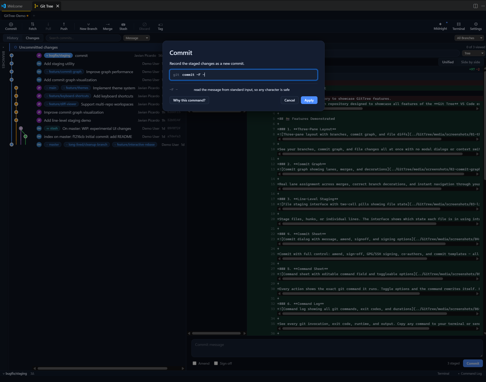
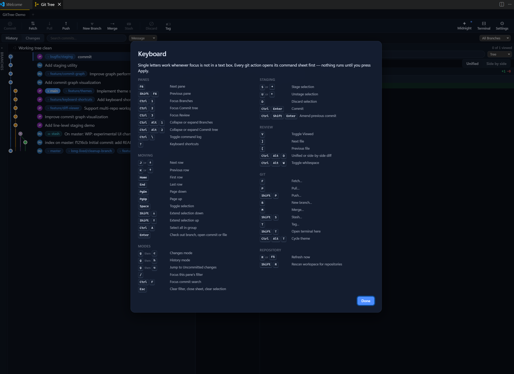
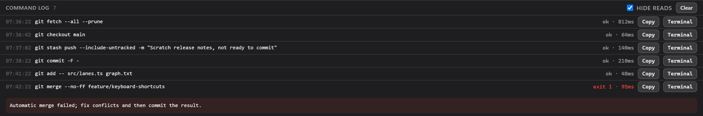
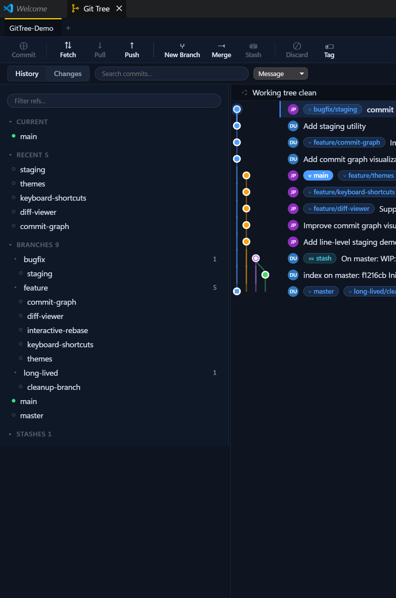
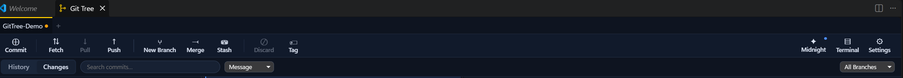
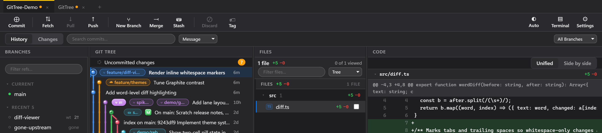
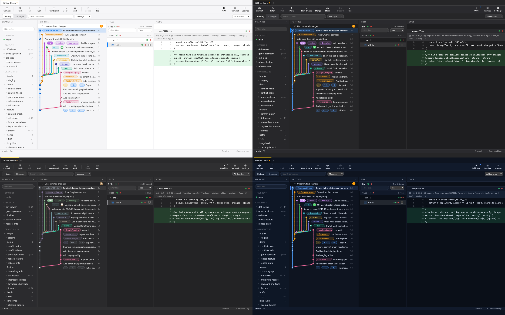

# Git Tree — Visual Git Management for VS Code

**A SourceTree-class Git client inside VS Code — featuring a real commit graph, line-level staging, multi-repo support, and a command sheet that teaches you Git while you use it.**

> Every button shows the exact Git command it runs. Every action is editable before execution. The GUI makes you better at the command line instead of hiding it.

---

## ✨ What Makes Git Tree Different

### 1. **Three-Pane Layout** — See Everything At Once

Unlike VS Code's flat file list, Git Tree shows your branches, commit graph, and changes side-by-side. No modal dialogs, no context switching.

- **Left pane:** Branches, tags, remotes, and stashes organized hierarchically with fuzzy-search filtering (180px default)
- **Middle pane:** The full commit graph with correct lane assignment, real-time updates as you work (250px default, collapsible)
- **Right pane:** File-level diff, line-level staging, and conflict resolution — all visible at once (890px default)
- **Fully draggable:** Resize any pane by dragging the divider; layout persists across sessions

### 2. **Commit Graph That Actually Works**

Real lane assignment across merges, decorations for HEAD/tags/upstream, author and date columns, and instant navigation. Virtualised so a 50,000-commit repository scrolls at full speed.

**Key features:**

- Click a commit to see its full diff side-by-side
- Navigate by keyboard: `j`/`k` to move, `Space` to select
- Filter by message, author, or date without re-rendering
- Decorated with refs (branches, tags, `HEAD`, upstream markers)

### 3. **Line-Level Staging** — Stage Exactly What You Mean

Pick individual lines, hunks, or whole files. The interface shows **which state each file is in** using a two-cell pill: `◧` (staged), `◨` (unstaged), or `◧◨` (both).

- Stage by file, hunk, or individual line
- Drag files between Staged and Unstaged groups
- **Drag the divider** between file list and diff to resize (persists across sessions)
- Use `→` and `←` keyboard shortcuts
- Multi-select with `Space`, arrow keys to navigate
- Discard with confirmation to prevent accidents

### 4. **Commit with Full Control**

Amend, sign-off, GPG/SSH signing, co-authors, and commit templates — all editable before you press Enter.

- **Pre-commit hooks** show their output verbatim, never replaced with "commit failed"
- **Co-authors** via trailer syntax (recognized by GitHub, GitLab, etc.)
- **Signing** — GPG or SSH (git handles the credential, GitTree just enables the flag)
- **Templates** — `.gitmessage` support

### 5. **The Command Sheet — Learn Git While You Click**

Every action opens a modal showing the exact command, **editable in real-time**. Toggle options and the command rewrites itself. Hover to see a plain-English explanation of each flag.

**Why this matters:**

- Mistyped? See the dialog **before anything runs**
- Want to add a flag? Edit the command directly
- Want to understand the flags? Hover for the teaching card
- **"Why this command?"** button explains the concept (what `--rebase` does, when `--force-with-lease` is safe)

### 6. **Command Log — Copy, Send to Terminal, or Re-run**

A live console of every git invocation, exit code, runtime, and output. Copy any command and paste it into your terminal. Or send it unsigned so you can read and edit it first.

- Scroll through your session history
- Copy any command verbatim (including pipes/redirects)
- "Send to Terminal" types it in the integrated terminal without running it
- Filter by command, repo, or date

### 7. **Branch Management at Scale**

With forty-seven branches, a flat list is useless. GitTree nests branches by `/`, collapses folders, and lets you fuzzy-search the full path.

- **Current** and **Recent** branches pinned above the tree
- Type to filter — matches the whole path, not just the prefix
- `Enter` checks out the best match (or double-click)
- Shows ahead/behind counts and whether upstream exists

### 8. **Fetch, Pull, Push, Merge, Stash — All at Your Fingertips**

One-click toolbar buttons for the most common operations. Each opens the command sheet for a second to review. Keyboard shortcuts available (press `?` to see them all).

| Action | Keyboard | Notes |
| --- | --- | --- |
| Fetch | `f` | `--all` and `--prune` by default |
| Pull | `p` | `--rebase --autostash` by default |
| Push | `Shift+P` | Sets upstream on first push |
| Branch Create | `b` | Checks out immediately |
| Merge | `m` | `--no-ff` by default (leaves history clear) |
| Stash Push | `s` | `--include-untracked` by default |

### 9. **Multi-Repo Workspaces**

Open a folder and GitTree finds every repository inside it — at any depth. Understands the difference between nested repos, submodules, and worktrees.

- **Tabs** for each open repository
- Scroll position, selection, and filters remembered per-repo
- Detects and explains submodules vs. nested repos (prevents accidents)
- Worktrees never presented as independent clones
- **+** button opens a folder dialog to add another repository

### 10. **Themes — Light, Dark, macOS, Graphite, Midnight**

Follows your VS Code theme by default. Also offers curated system-class alternatives.

- Cycle themes with `Ctrl+Alt+T` (macOS: `⌘+⌥+T`)
- High-contrast mode fully supported
- Animations respect `prefers-reduced-motion`

---

## 🎬 Feature Walkthroughs

### Workflow: Stage a Change and Commit It

Find a file with changes, click specific lines or hunks to stage, write a commit message, and press Ctrl+Enter to commit. All changes are visible before you run anything.

### Workflow: Check Out a Branch Via Sidebar

Type in the filter box to find a branch, press Enter to switch. Watch the graph and diff update in real time as you work across branches.

### Workflow: Fetch, Review, and Push

Press `f` for fetch, review incoming changes in the graph, press `Shift+P` to push when ready. Full visibility into what's being pushed.

---

## 📋 Complete Feature List

✅ **Working today:**

- ✓ Repository discovery (nested, submodules, worktrees, at any workspace depth)
- ✓ Real commit graph with correct merge lane assignment
- ✓ Status and staging (file / hunk / individual line)
- ✓ Commit (amend, sign-off, GPG/SSH signing, co-authors, templates)
- ✓ Diff (file-level and line-level, side-by-side and inline)
- ✓ History search (by message or author)
- ✓ Fetch, Pull, Push, Branch, Merge, Stash, Tag operations
- ✓ Branch checkout and delete via sidebar
- ✓ Stash pop/drop operations
- ✓ Command log and editable command sheet
- ✓ Remote management (add / remove / setUrl)
- ✓ Settings panel (identity, appearance, repository details)
- ✓ Integrated terminal with command clipboard
- ✓ Themes (Light, Dark, macOS Light/Dark, Graphite, Midnight)
- ✓ Full keyboard navigation
- ✓ Multi-repo workspaces with per-repo state
- ✓ Open another repository dialog (+ button)

---

## 🛠️ Requirements

|  |  |
| --- | --- |
| **VS Code** | 1.100 or newer |
| **Git** | 2.11 or newer, on your `PATH` (2.20+ recommended) |
| **Platforms** | Windows, macOS, Linux |

GitTree runs **your** Git binary, so your config, credential helpers, hooks, SSH keys, and signing setup all work exactly as they do in a terminal. Nothing is reimplemented, and no credentials pass through the extension.

**Git not on PATH?** Set `gitTree.git.path` in settings to the absolute path.

---

## 🚀 Getting Started

### Installation

1. **Install Git Tree** from the [VS Code Extensions marketplace](https://marketplace.visualstudio.com/items?itemName=javian-picardo-group-inc.git-tree)
2. **Reload VS Code**

### Opening Git Tree

Choose any of these methods:

**Method 1: Activity Bar** (Easiest)

- Click the **Git Tree icon** in the left activity bar (branch icon)
- Or press `Ctrl+Shift+G` then `T` (Windows/Linux) / `Cmd+Shift+G` then `T` (macOS)

**Method 2: Command Palette**

- Press `Ctrl+Shift+P` (Windows/Linux) or `Cmd+Shift+P` (macOS)
- Type `Git Tree` to see commands:
  - **Git Tree: Open GitTree** — Open the main panel
  - **Git Tree: Refresh Repositories** — Refresh repo list
  - **Git Tree: Rescan Workspace for Repositories** — Find all repos
  - **Git Tree: Reveal Repository in GitTree** — Jump to a repo

**Method 3: Explorer Context Menu**

- Right-click any folder in Explorer
- Select "Reveal Repository in GitTree"

### First Time Setup

1. **Open a folder** — or a parent folder holding several repositories
2. **Click a repository** in the Repositories view to open it as a tab
3. Click the **+** button to add more repositories

The panel opens with three panes: **Branches** (left), **Commit Graph** (middle), **File Changes** (right).

---

## 💡 Quick Tips Inside Git Tree

**Press** `?` **inside Git Tree** to see the full keyboard reference.

**Common in-app actions:**

- **Commit**: Click the **Commit** button in the toolbar, or press `Ctrl+Enter` with a message
- **Pull/Push/Fetch**: Click the toolbar buttons or use keyboard shortcuts
- **Create Branch**: Click **New Branch** or press `b`
- **Checkout Branch**: Type `/` to filter branches, then press `Enter`
- **View Keyboard Shortcuts**: Press `?` inside Git Tree
- **Open Settings**: Click the **Settings** icon (gear) in top right
- **Cycle Themes**: Press `Ctrl+Alt+T`

📖 **Pro Tip:** Press `?` inside Git Tree to see all keyboard shortcuts instantly. For a complete workflows guide with printable shortcuts, visit the [GitHub repository](https://github.com/JavianDev/GitTree) and download `COMMANDS.md`.

---

## ⌨️ Keyboard Shortcuts

Press `?` in Git Tree for the full list. Here's the quick reference:

| Action | Keys |
| --- | --- |
| Move (up/down) | `j` / `k` |
| Select | `Space` |
| Stage / Unstage | `s` / `u` |
| Commit | `Ctrl+Enter` |
| Filter refs | `/` |
| Fetch / Pull / Push | `f` / `p` / `Shift+P` |
| Branch / Merge | `b` / `m` |
| Stash | `Shift+S` |
| Changes / History | `g` `c` / `g` `h` |
| Focus pane 1/2/3 | `Ctrl+1` / `Ctrl+2` / `Ctrl+3` |
| Cycle theme | `Ctrl+Alt+T` |

---

## ⚙️ Settings

| Setting | Default | What it does |
| --- | --- | --- |
| `gitTree.git.path` | *(auto)* | Absolute path to your Git binary |
| `gitTree.discovery.maxDepth` | `4` | Folder depth to scan for repositories |
| `gitTree.discovery.excludeGlobs` | `[]` | Extra folder names to skip |
| `gitTree.followActiveEditor` | `true` | Active repo follows the file you're editing |
| `gitTree.autoRefresh` | `true` | Auto-refresh when files change (press `r` to toggle) |
| `gitTree.accentColor` | `#007AFF` | Interface accent color |
| `gitTree.graph.density` | `comfortable` | Commit graph row height |
| `gitTree.dateFormat` | `relative` | How commit dates render (relative/absolute/iso) |

`node_modules`, `dist`, `build`, `target`, `.venv` and similar are skipped automatically.

---

## 🔒 Privacy

Git Tree runs **entirely on your machine**. It executes your local Git binary and reads your repositories. It sends **nothing** anywhere — no telemetry, no analytics, no network access of any kind.

Future AI features will be **off by default**, require explicit opt-in, show you the exact payload before anything is sent, and never run in the background.

---

## 💙 Support Git Tree

Git Tree is **free and open source**. If you find it useful and want to support development:

[**☕ Buy Me a Coffee**](https://buymeacoffee.com/javian) — Help keep Git Tree maintained and improved.

Your support goes directly towards:

- Bug fixes and stability improvements
- New features and enhancements
- Documentation and community support

---

## 📄 License

Copyright (c) 2026 Javian Picardo Group Inc

Licensed under the MIT License. See the [LICENSE](LICENSE) file for details.

---

## 🔗 Resources

- [**GitHub Repository**](https://github.com/JavianDev/GitTree) — Source code, issues, and contributions
- [**Marketplace**](https://marketplace.visualstudio.com/items?itemName=javian-picardo-group-inc.git-tree) — Install the extension

---

**Made with ❤️ by Javian Picardo Group Inc**