# Git Tree — Visual Git Management for VS Code

**A SourceTree-class Git client inside VS Code — featuring a real commit graph, line-level staging, multi-repo support, and a command sheet that teaches you Git while you use it.**

> Every button shows the exact Git command it runs. Every action is editable before execution. The GUI makes you better at the command line instead of hiding it.

### 💛 Support Git Tree

[](https://buymeacoffee.com/javian)

Git Tree is **free and open source**. If you find it useful, [buying a coffee](https://buymeacoffee.com/javian) helps keep it maintained — bug fixes, new features, and documentation.

---

## 🆕 New in 0.13 — Fewer Clicks, Clearer Errors

- **Stage / Unstage buttons:** every section has **Stage All** or **Unstage All**, and the file under
  your pointer (or every selected file) has its own **Stage** or **Unstage** button, beside the
  checkboxes.
- **Errors you can act on:** when git refuses something, a small card floats over the panel, names the
  problem in a line, and offers the fix — **Stash & Retry** when uncommitted work blocks a checkout,
  **Pull** for a rejected push, **Push and Set Upstream** for a new branch — with **Copy** for git's
  own message.

  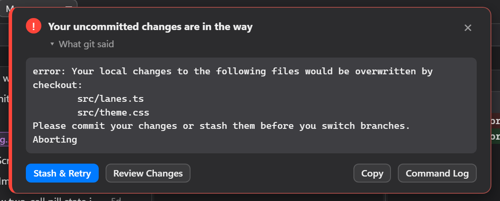

- **Pull requests from new branches:** a source branch that isn't on the remote yet is pushed first
  (**Push & Create**), so GitHub never answers "head invalid".
- **Sheets close when done:** a toolbar command that succeeds closes its sheet; a failure keeps it
  open with git's output.
- **A Git Tree button in the status bar** opens the panel from anywhere.
- **Everything follows Git Tree's theme**, including scrollbars, checkboxes, dropdowns and code text,
  even when VS Code uses a different one.

## New in 0.12 — Act on Any Commit

- **Double-click a commit** to check out its branch. A commit with only a remote branch, or no
  branch, opens the checkout sheet first, so you read the command before you land on a new branch
  or a detached HEAD.
- **Right-click a commit** for every action: Check Out, Merge, Rebase, New Branch, New Tag,
  Cherry-pick, Reverse Commit, Reset (soft / mixed / hard), Archive, Create Patch, and Copy SHA. Each
  shows its exact git command before it runs. **Show Details**, at the top of the menu, opens the
  commit's parents, author and date, committer and commit date, and full message beside it.
- **Click a commit's dot** in the graph to see the same details on their own.

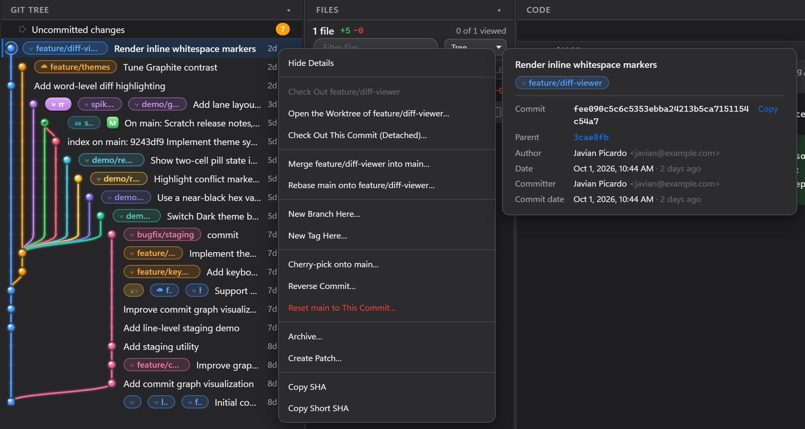

## New in 0.11 — Worktrees

- **A WORKTREES section** right after Branches: every working folder of the repository, grouped by
  branch folder, with `main`, `current`, `locked`, `missing` and `detached` badges, change counts,
  ahead/behind, and colour labels (§14)
- **New Worktree** (`W`, `Ctrl+Shift+G W`): a new branch from any branch, tag or commit — or an existing
  branch, a remote branch tracked locally, or a tag checked out detached — into a folder Git Tree
  suggests, with untracked files like `.env` copied across and the exact `git worktree add` shown first
- **Worktree details** in the Files pane: staged, changed and untracked files, and the commits it has
  not pushed, with their diffs in the Code pane
- **Open** a worktree as a Git Tree tab, in a new VS Code window, or in this one; **Reveal**, **Terminal**,
  **Copy Path**, **Lock**, **Move**, **Remove** (asking for exactly the `--force` it needs), **Prune**,
  **Repair**, and **Clean Up Gone Branches**
- **Settings ▸ Worktrees**: where each repository's worktrees go (beside it, in a folder inside it, or
  anywhere), and what happens when one is created, opened or removed
- A branch checked out in another worktree is marked `wt`, and double-clicking it offers that worktree
  instead of a `git switch` that cannot work
- **Stashes** moved to the very end of the sidebar

## New in 0.10

- **Commit, Push and Stash tabs** in the Files pane — the commits a push would send, and every stash
  with Apply / Pop / Drop on the row (§8)
- **✨ AI commit messages** drafted from your staged diff by the model you already use in VS Code,
  plus **Commit & Push** and a **Run git hooks** switch (§4)
- **Checkbox staging** — Staged Changes, Changes and Untracked Changes sections, a stage checkbox and
  file-type icon on every file (§3)
- **Panes that fit their text** — branch names, commit messages and file names show in full without
  dragging a divider, and every pane has a title bar with a ◂ button to hide it (§1)
- **A redrawn commit graph** — messages sit right beside their nodes, glassy nodes, merge badges,
  branch pills in their lane's colour (§2)
- **Browser sign-in for Bitbucket and GitLab** pull requests (§11)

---

## ✨ What Makes Git Tree Different

### 1. **Four-Pane Layout** — See Everything At Once

Unlike VS Code's flat file list, Git Tree shows your branches, commit graph, and changes side-by-side. No modal dialogs, no context switching.


- **Branches pane:** Branches, tags, remotes, and stashes organized hierarchically with fuzzy-search filtering
- **Git Tree pane:** The full commit graph with correct lane assignment, real-time updates as you work
- **Files pane:** The changed files, with line-level staging and conflict resolution from the right-click menu
- **Code pane:** The diff itself, unified or side by side, in its own full-height column
- **Fully draggable:** Resize any pane by dragging the divider; layout persists across sessions
- **Panes fit their text:** Branches, Git Tree and Files open wide enough to show branch names,
  commit messages and file names in full, with no gap between panes — no dragging needed.
  Double-click a divider to fit the pane on its left again
- **Title bars:** every pane is labelled, with a ◂ button in its title bar to hide it; click its rail to
  bring it back
- **Files and Code panes:** the file list and the diff are separate panes, each resizable and
  collapsible — four panes in all: Branches | Git Tree | Files | Code
- **Focus diff:** Click a file (in Changes or in a commit) and the Branches and Git Tree panes fold to
  thin rails so Files and Code get the full width (as in the staging screenshot in §3) —
  **⇤ Restore panels** (or clicking a rail) brings them back, each pane sized to its text again
- **New files show their contents:** an untracked file's whole content appears as added lines,
  not an empty pane

### 2. **Commit Graph That Actually Works**

Real lane assignment across merges, decorations for HEAD/tags/upstream, author and date columns, and instant navigation. Virtualised so a 50,000-commit repository scrolls at full speed.


**Key features:**

- Each message starts right beside its own node — no wide graph column pushing every row's text away
- Glassy nodes: orbs for commits, lenses for merges (with an **M** badge), a gem for the root commit
- Branch pills tinted in their lane's colour; the checked-out branch is a filled pill
- Author and date are aligned columns, and drop out first when the pane is narrow so the message keeps
  the room
- Click a commit to see its full diff side-by-side
- Navigate by keyboard: `j`/`k` to move, `Space` to select
- Filter by message, author, or date without re-rendering
- Decorated with refs (branches, tags, `HEAD`, upstream markers)

### 3. **Line-Level Staging** — Stage Exactly What You Mean

Pick individual lines, hunks, or whole files. The Files pane has **Staged Changes**, **Changes** and **Untracked Changes** sections; every file has a stage checkbox and a file-type icon, and every section a tick-all checkbox and a file count. Prefer buttons? Each section has **Stage All** / **Unstage All**, and the file under your pointer — or every selected file — has a **Stage** / **Unstage** button.


- Stage by file (tick its checkbox), a whole section (tick its header), a hunk, or individual lines
- Names are coloured by what happened to the file: added green, deleted struck through, renamed blue
- New files have their own **Untracked Changes** section, as in VS Code's Source Control view — and
  selecting one shows its whole content as added lines
- **Toolbar** on the summary row: ↺ discard all changes to tracked files (untracked files are kept),
  ⊞ expand and ⊟ collapse every folder, ⟳ refresh
- Drag files between Staged and Unstaged groups
- **Drag the divider** between file list and diff to resize (persists across sessions)
- Use `→` and `←` keyboard shortcuts
- Multi-select with `Space`, arrow keys to navigate
- Discard with confirmation to prevent accidents

### 4. **Commit with Full Control**

Amend, sign-off, GPG/SSH signing, co-authors, and commit templates — all editable before you press Enter.


- **✨ AI commit messages** — one click drafts a summary and description from your staged diff (or
  from every change when nothing is staged), using the AI model you already have in VS Code, such as
  GitHub Copilot, through VS Code's own language-model API. No API key and no extra account; VS Code
  asks your permission the first time. The note beside ✨ says which model wrote the draft — review it
  before committing. With no model available, it drafts a message from the changed files instead and
  says so
- **Summary + description** fields, like GitHub Desktop: the commit message is the summary, a blank
  line, then the description. Amend and an in-progress merge fill both in for you
- **Commit & Push** (`Ctrl+Shift+Enter`) beside **Commit** (`Ctrl+Enter`) — commits, then pushes to
  `origin`, setting the upstream on a branch's first push. A refused push is shown verbatim, after the
  commit has landed
- **Run git hooks** — on by default; untick to commit with `--no-verify`
- **Pre-commit hooks** show their output verbatim, never replaced with "commit failed"
- **Co-authors** via trailer syntax (recognized by GitHub, GitLab, etc.)
- **Signing** — GPG or SSH (git handles the credential, GitTree just enables the flag)
- **Templates** — `.gitmessage` support

### 5. **The Command Sheet — Learn Git While You Click**

Every action opens a modal showing the exact command, **editable in real-time**. Toggle options and the command rewrites itself. Hover to see a plain-English explanation of each flag.


**Why this matters:**

- Mistyped? See the dialog **before anything runs** — above, Push on a branch with no upstream adds
  `--set-upstream` for you and says why
- Want to add a flag? Edit the command directly
- Want to understand the flags? Hover for the teaching card
- **"Why this command?"** button explains the concept (what `--rebase` does, when `--force-with-lease` is safe)

### 6. **Command Log — Copy, Send to Terminal, or Re-run**

A live console of every git invocation, exit code, runtime, and output. Copy any command and paste it into your terminal, or send it to the integrated terminal to read and edit before you run it.


- Scroll through your session history for the repository you're in; `Ctrl+\` opens and closes it
- **Copy** any command verbatim
- **Terminal** types it in the integrated terminal without running it
- A failed command shows git's own error right under it (above: a merge that hit conflicts)
- **Hide reads** keeps the log to the commands that changed something

### 7. **Branch Management at Scale**

With forty-seven branches, a flat list is useless. GitTree nests branches by `/`, collapses folders, and lets you fuzzy-search the full path.


- **Current** and **Recent** branches pinned above the tree
- Type to filter — matches the whole path, not just the prefix, and highlights the match
- The pane widens to fit the names it shows; double-click the divider to refit it after filtering
- `Enter` checks out the best match (or double-click)
- Shows ahead/behind counts and whether upstream exists

### 8. **Fetch, Pull, Push, Merge, Stash — All at Your Fingertips**

One-click toolbar buttons for the most common operations. Each opens the command sheet for a second to review. Keyboard shortcuts available (press `?` to see them all).


| Action | Keyboard | Notes |
| --- | --- | --- |
| Fetch | `f` | `--all` and `--prune` by default |
| Pull | `p` | `--rebase` by default; tick **Autostash** in the sheet to shelve uncommitted work around it |
| Push | `Shift+P` | Sets upstream on first push |
| Branch Create | `b` | Checks out immediately |
| Merge | `m` | `--no-ff` by default (leaves history clear) |
| Stash Push | `Shift+S` | `--include-untracked` by default |

**Push and Stash tabs.** The Files pane has a tab for each, beside **Commit**, with a count on each:

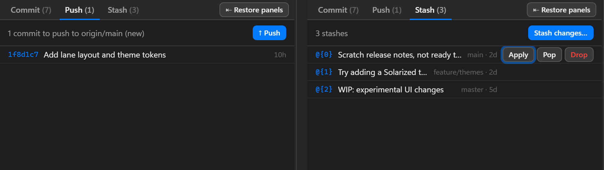

- **Push (N)** lists exactly the commits a push would send — against the upstream, or every
  unpublished commit on a branch that has none yet — with **↑ Push**, and **↓ Pull N** when you're behind
- **Stash (N)** lists every stash with its source branch and age; **Apply**, **Pop** and **Drop** sit on
  the row, and **Stash changes…** stashes what you have
- Each button opens the same review-before-run command sheet as the toolbar

### 9. **Multi-Repo Workspaces**

Open a folder and GitTree finds every repository inside it — at any depth. Understands the difference between nested repos, submodules, and worktrees.


- **Tabs** for each open repository
- Scroll position, selection, and filters remembered per-repo
- Detects and explains submodules vs. nested repos (prevents accidents)
- Worktrees never presented as independent clones
- **+** button opens a folder dialog to add another repository

### 10. **Themes — Light, Dark, macOS, Graphite, Midnight**

**Auto** follows your VS Code theme, light or dark. **macOS Light**, **macOS Dark**, **Graphite** and
**Midnight** are curated alternatives — above: Light, macOS Dark, Graphite and Midnight.


- Cycle themes with `Ctrl+Alt+T` (macOS: `⌘+⌥+T`)
- High-contrast mode fully supported
- Animations respect `prefers-reduced-motion`

### 11. **Pull Requests — GitHub, Azure DevOps, GitLab, Bitbucket**

The sidebar's Pull Requests section appears automatically the moment your repo's remote points at
GitHub, Azure DevOps, GitLab, or Bitbucket (cloud) — no settings screen, no org/project to type in,
nothing to configure. GitHub and Azure DevOps sign in through VS Code's own GitHub/Microsoft
accounts. Bitbucket and GitLab support the same kind of **browser sign-in** — approve Git Tree on
bitbucket.org / gitlab.com and you're returned to VS Code, no token to create or paste — whenever a
Git Tree app registration is available (built in, or your own in Settings; see
[docs/oauth-setup.md](docs/oauth-setup.md)). Otherwise, and for workspaces that block third-party
apps, Bitbucket takes an [API token](https://id.atlassian.com/manage-profile/security/api-tokens)
created *with scopes* for Bitbucket and GitLab a personal access token. Logins live in VS Code's
secret storage and refresh automatically; a rejected one is forgotten so you're simply asked again.

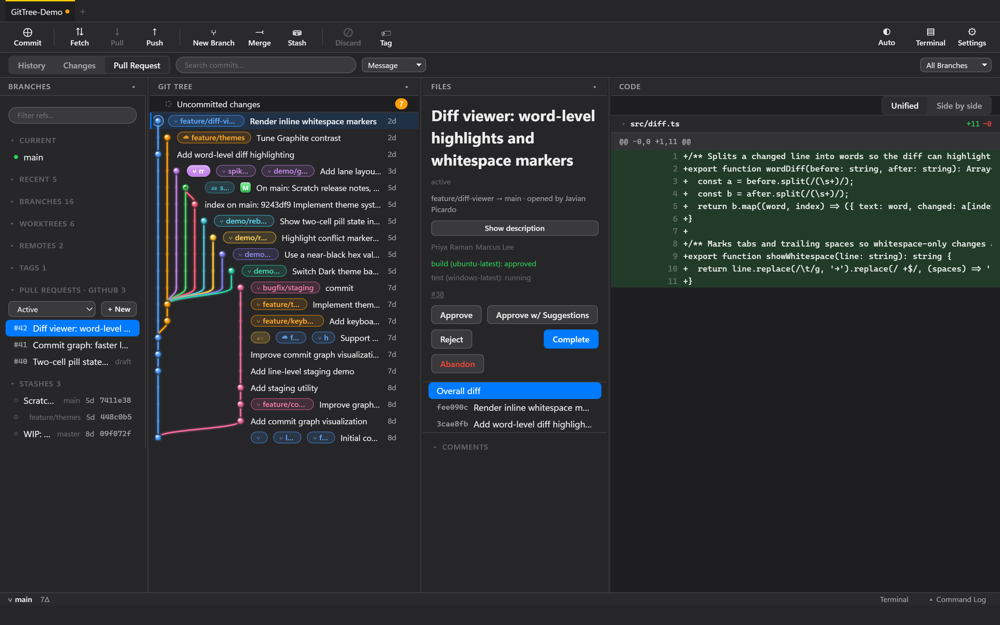

- List open, completed, or abandoned pull requests with a status filter
- Create a PR against any branch, mark it draft, write the description — a branch that isn't on the
  remote yet is pushed first (**Push & Create**)
- Vote — approve, approve with suggestions, reject, or (Azure DevOps only) wait for author
- Complete with squash and delete-source-branch options; Azure DevOps adds a policy-bypass override
- Overall diff and per-commit diff, reusing the same diff viewer as everywhere else in Git Tree
- Comment threads, read and reply to, right from the sidebar
- Policy/check/pipeline status and linked work items or issues, shown per PR when the provider has them

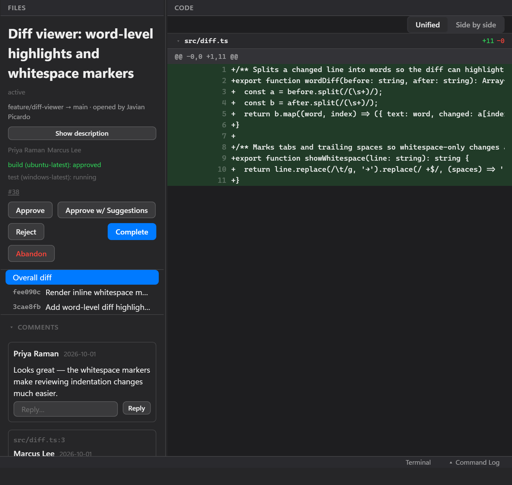

### 12. **Full Stash Management**

Every stash is listed, not just the most recent one — click any to preview its diff before deciding
what to do with it.

- View every stash with its message, source branch, and age
- Click to preview its diff without disturbing your current branch or selection
- **Apply**, **Pop**, or **Drop** from the right-click menu or the Stash tab's rows (§8) — Drop
  requires confirmation
- Stash with a custom message from the same command sheet used for every other action

### 13. **Resolving Merge Conflicts — Mine, Theirs, or Manual**

A right-click away: keep your side, keep the incoming side, or open the file and resolve it by
hand with VS Code's own conflict-marker editing tools. A banner explains exactly what "mine" and
"theirs" mean for what you're doing right now — which matters because **the meaning reverses during
a rebase**, a detail most git tools leave you to discover the hard way.

- **Resolve Using Mine** or **Resolve Using Theirs**, one click, no confirmation dialog required
- Works correctly on every conflict shape, including add/delete conflicts where one side has no file at all
- **Open to Resolve Manually** hands the file to VS Code's built-in editor, where Accept
  Current/Incoming/Both appear automatically above the conflict markers
- **Mark as Resolved** after manual edits — the same staging step as everywhere else in Git Tree
- A persistent banner names the operation (merge, rebase, cherry-pick, or revert), shows how many
  conflicts remain, and explains mine/theirs correctly for that specific operation:

  | Operation | "Mine" is | "Theirs" is |
  | --- | --- | --- |
  | Merge | Your current branch | The branch being merged in |
  | Rebase | The branch you're rebasing **onto** (git calls this "ours" here — easy to get backwards) | Your own commit being replayed |
  | Cherry-pick | Your current branch | The commit being cherry-picked |
  | Revert | Your current branch | The commit being reverted |
- **Continue** and **Abort** buttons once every conflict is resolved (or if you want to back out
  entirely) — Continue for a merge simply means committing, prefilled with git's own merge message

### 14. **Worktrees — Two Branches at Once, No Stashing**

A worktree is a second folder checked out from the same repository: its own branch, files and staged
changes, sharing one object store, so there is nothing to clone and a commit made in one is
immediately visible in the others. Review a pull request, run a long build, or fix a bug on another
branch without stashing or switching what you're in the middle of.

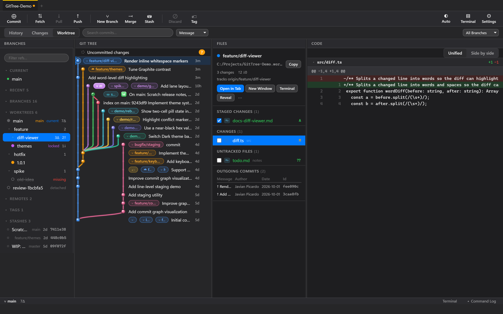

**The WORKTREES section** sits right after BRANCHES and lists every worktree of the repository: the
main one pinned first, the rest grouped by their branch's folder (`feature/…`), each with

- `main` and `current` badges, `locked` (with its reason in the tooltip), `missing` for a folder that
  was deleted, and `detached` for a commit or tag checked out on no branch
- uncommitted changes (`3∆`) and how far it is ahead of or behind its upstream (`2↑`, `1↓`)
- a colour label — shown as a dot, and as the accent on its repository tab
- the full path and the shortest path that tells it apart, in the tooltip

The filter box finds worktrees by branch or folder name, just as it finds branches.

**Click** a worktree to see its details: branch, path, change count, ahead/behind and upstream, then its
Staged Changes, Changes and Untracked Files (tick a box to stage *in that worktree*), and the commits
it hasn't pushed. Selecting a file or commit shows its diff in the Code pane. **Double-click** opens it.

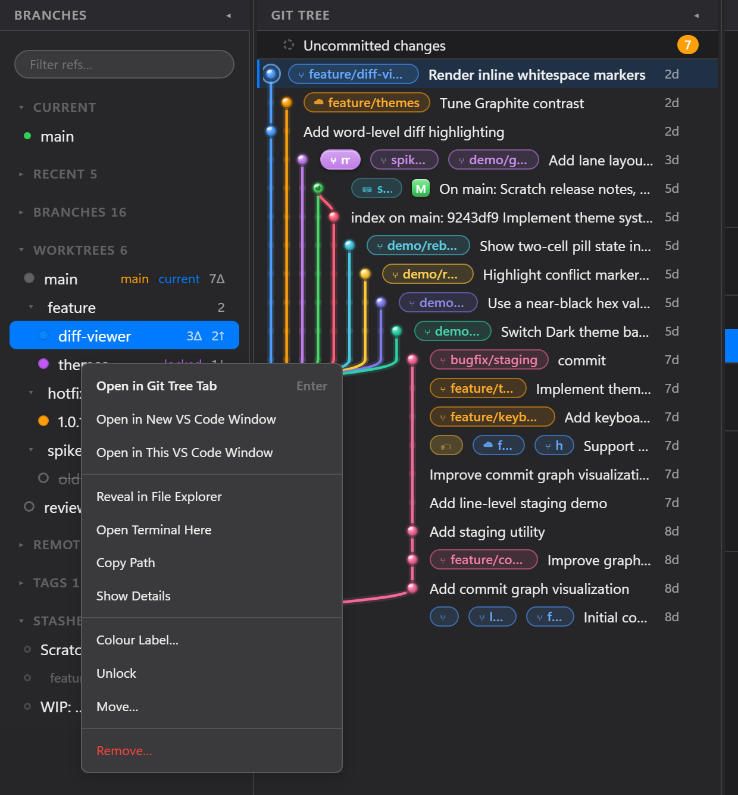

**Right-click** for everything else. Actions git (or safety) won't allow are greyed out with the reason —
you can't remove the main worktree, the one this tab is showing, or one open in this window.

- **Open in Git Tree Tab** — it becomes a repository tab here, even when the folder is outside your workspace
- **Open in New VS Code Window** / **This Window** — reopening the same sub-folder you're in (a monorepo
  package, say) when it exists there
- **Reveal in File Explorer**, **Open Terminal Here**, **Copy Path**, **Colour Label…**
- **Lock…** (with a reason) / **Unlock**, **Move…**, **Remove…**
- From the section's ⋯ menu: **Prune Stale Worktrees…**, **Repair Worktree Links…**,
  **Clean Up Gone Branches…** (local branches whose remote branch was deleted), **Worktree Settings…**

**New Worktree** — press `W`, click **+** on the section, choose *New Worktree from This Branch…* on a
branch or tag, or run *GitTree: New Worktree…* (`Ctrl+Shift+G W`) from the command palette:

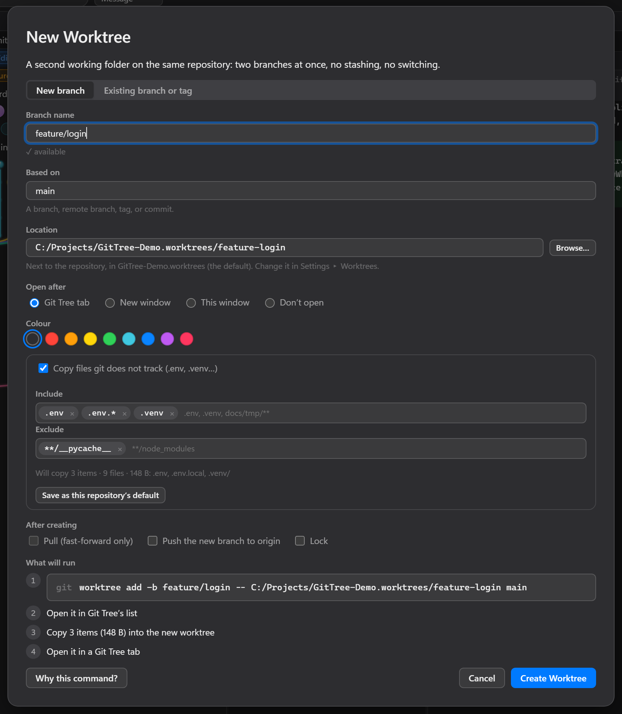

- **New branch** based on any branch, remote branch (tracked or not), tag, or commit — the name is
  checked against git's rules as you type
- **Existing branch or tag** — a local branch (one already checked out elsewhere is shown as such), a
  remote branch checked out as a new tracking branch, or a tag or commit checked out detached
- **Location** suggested from your settings and editable, with Browse…; a taken folder gets `-2`
- **Copy files git doesn't track** — `.env`, `.env.*`, `.venv`, build caches — from this worktree into the
  new one, with a preview of what and how much. Nothing is ever overwritten, `.git` is never copied,
  and the copy stops at 25,000 files, 1 GB or a minute. *(A copied Python venv still points at the old
  folder in its activate scripts; recreate it if that matters.)*
- **After creating** — pull (fast-forward only), push the new branch, lock it
- **What will run** lists every step, the `git worktree add` command is editable, and each step's
  output appears as it runs — all of it in the command log

**Removing** asks for exactly what git needs, and says why:

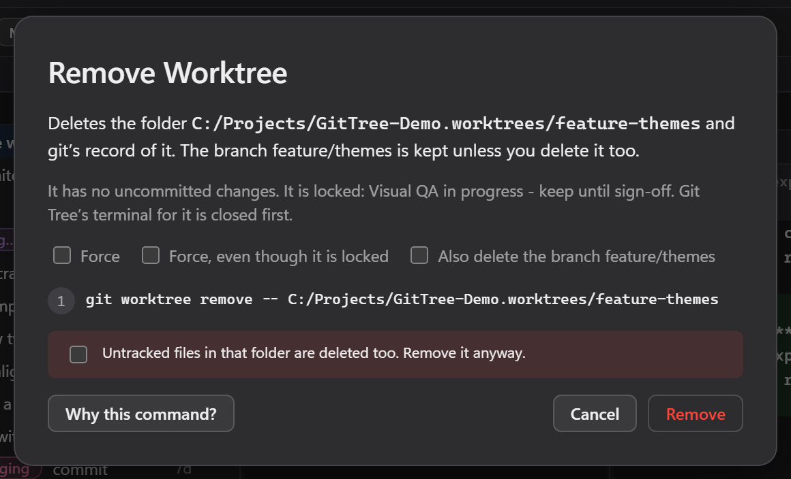

one `--force` to discard uncommitted changes, `--force` twice for a locked worktree, and optionally the
branch too (`-d`, or `-D` if unmerged) — pre-ticked when its remote branch is gone if you choose. Git
Tree closes its own terminal and file watchers on the folder first, so Windows lets git delete it.

**A branch can live in one worktree at a time**, so a branch checked out elsewhere is marked `wt` in
BRANCHES, and double-clicking it offers to open that worktree rather than running a `git switch` that
would fail:

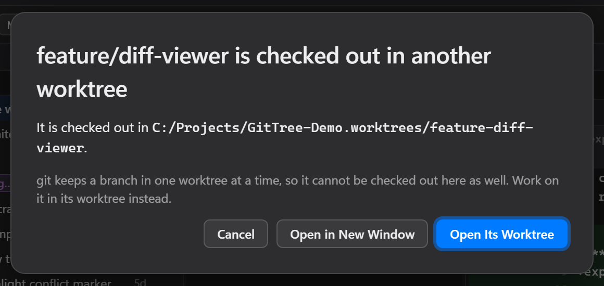

**Settings ▸ Worktrees** sets where worktrees go and how they behave — for this repository, or as the
default for all of them (your VS Code settings):

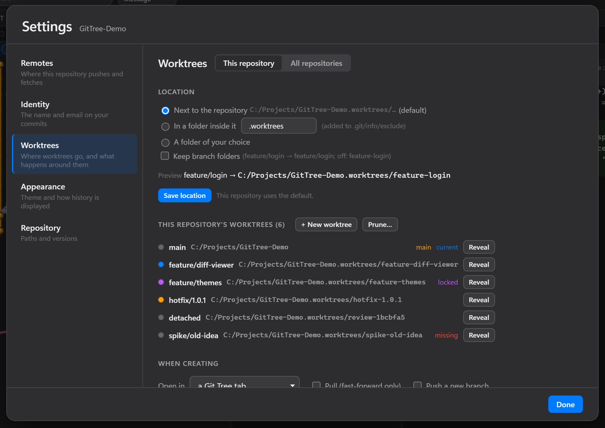

| Setting | Default | What it does |
| --- | --- | --- |
| `gitTree.worktrees.directory` | *(beside the repository)* | Folder for new worktrees. Empty means `<repo>.worktrees` next to the repository. Variables: `${userHome}`, `${repoName}`, `${repoParent}`, `${repoRoot}`, `${branch}`, and `~` |
| `gitTree.worktrees.subfolder` | `""` | Put worktrees in a folder *inside* the repository instead (e.g. `.worktrees`, added to `.git/info/exclude`) |
| `gitTree.worktrees.preserveBranchHierarchy` | `false` | `feature/login` → `feature/login` instead of `feature-login` |
| `gitTree.worktrees.openBehavior` | `gitTreeTab` | After creating, and on double-click: `gitTreeTab`, `newWindow`, `currentWindow`, or `none` |
| `gitTree.worktrees.preserveSubfolder` | `true` | Opening in a window reopens the sub-folder you're in |
| `gitTree.worktrees.autoPull` / `autoPush` | `false` | Pre-tick pull (`--ff-only`) / push (`--set-upstream`) after creating |
| `gitTree.worktrees.copyInclude` / `copyExclude` | `[]` | Untracked files to copy into new worktrees, as globs (`.env`, `.venv`, `docs/tmp/**`) |
| `gitTree.worktrees.deleteGoneBranchOnRemove` | `false` | Pre-tick deleting the branch when its remote branch is gone |
| `gitTree.worktrees.colorLabels` | `true` | Colour dots and tab accents |
| `gitTree.worktrees.titleBarTint` | `off` | `workspaceFile` tints a coloured worktree's window title bar (via a `.code-workspace` in Git Tree's storage — nothing is written in the repository) |
| `gitTree.discovery.extraPaths` | `[]` | Extra folders to scan for repositories and worktrees, when the workspace root isn't one |

Location, sub-folder, hierarchy and copy patterns can each be set per repository in Settings ▸ Worktrees.

---

## 🎬 Feature Walkthroughs

### Workflow: Stage a Change and Commit It

Find a file with changes, click specific lines or hunks to stage, write a commit message, and press Ctrl+Enter to commit. All changes are visible before you run anything.

### Workflow: Check Out a Branch Via Sidebar

Type in the filter box to find a branch, press Enter to switch. Watch the graph and diff update in real time as you work across branches.

### Workflow: Review a Pull Request in a Worktree

Right-click the PR's branch in BRANCHES → **New Worktree from This Branch…** → **Create**. It opens in its
own tab with your current branch untouched — build it, run it, comment, then **Remove** the worktree
from its right-click menu when you're done.

### Workflow: Fetch, Review, and Push

Press `f` for fetch, review incoming changes in the graph, press `Shift+P` to push when ready. Full visibility into what's being pushed.

---

## 📋 Complete Feature List

✅ **Working today:**

- ✓ Repository discovery (nested, submodules, worktrees, at any workspace depth)
- ✓ Real commit graph with correct merge lane assignment
- ✓ Status and staging (file / hunk / individual line)
- ✓ Stage All / Unstage All per section, and Stage / Unstage buttons on files
- ✓ Commit actions from the graph: double-click to check out; right-click to merge, rebase, cherry-pick, revert, reset, tag, branch, archive, create a patch, or copy the SHA, with the commit's details
- ✓ Git errors as a card with fixes (Stash & Retry, Review Changes, Pull, Push and Set Upstream) and Copy
- ✓ Commit (amend, sign-off, GPG/SSH signing, co-authors, templates), Commit & Push, skip hooks
- ✓ AI-drafted commit messages via VS Code's language models (e.g. GitHub Copilot)
- ✓ Commit / Push / Stash tabs in the Files pane
- ✓ Worktrees — list, create (new or existing branch, tag, commit), open as a tab or window, details,
  lock / unlock, move, remove, prune, repair, clean up gone branches, colour labels, per-repository
  location (see §14)
- ✓ Diff (file-level and line-level, side-by-side and inline)
- ✓ History search (by message or author)
- ✓ Fetch, Pull, Push, Branch, Merge, Stash, Tag operations
- ✓ Branch checkout and delete via sidebar
- ✓ Full stash management — view every stash, preview its diff, apply / pop / drop (see §12)
- ✓ Pull Requests — GitHub, Azure DevOps, GitLab, and Bitbucket, auto-detected with zero configuration;
  list, create, vote, complete/merge, abandon, comment threads (see §11)
- ✓ Merge conflict resolution — one-click Resolve Using Mine/Theirs, or resolve manually with
  VS Code's own editor; a banner explains mine/theirs correctly for merge, rebase, cherry-pick,
  and revert (see §13)
- ✓ Command log and editable command sheet
- ✓ Remote management (add / remove / setUrl)
- ✓ Settings panel (identity, appearance, repository details)
- ✓ Integrated terminal with command clipboard
- ✓ Themes (Light, Dark, macOS Light/Dark, Graphite, Midnight)
- ✓ Full keyboard navigation
- ✓ Multi-repo workspaces with per-repo state
- ✓ Open another repository dialog (+ button)

---

## 🛠️ Requirements

|  |  |
| --- | --- |
| **VS Code** | 1.100 or newer |
| **Git** | 2.11 or newer, on your `PATH` (2.20+ recommended) |
| **Platforms** | Windows, macOS, Linux |

GitTree runs **your** Git binary, so your config, credential helpers, hooks, SSH keys, and signing setup all work exactly as they do in a terminal. Nothing is reimplemented, and no credentials pass through the extension.

**Git not on PATH?** Set `gitTree.git.path` in settings to the absolute path.

---

## 🚀 Getting Started

### Installation

1. **Install Git Tree** from the [VS Code Extensions marketplace](https://marketplace.visualstudio.com/items?itemName=javian-picardo-group-inc.git-tree)
2. **Reload VS Code**

### Opening Git Tree

Choose any of these methods:

**Method 1: Activity Bar** (Easiest)

- Click the **Git Tree icon** in the left activity bar (branch icon)
- Or click **Git Tree** in the status bar at the bottom of the window
- Or press `Ctrl+Shift+G` then `T` (Windows/Linux) / `Cmd+Shift+G` then `T` (macOS)

**Method 2: Command Palette**

- Press `Ctrl+Shift+P` (Windows/Linux) or `Cmd+Shift+P` (macOS)
- Type `Git Tree` to see commands:
  - **Git Tree: Open GitTree** — Open the main panel
  - **Git Tree: Refresh Repositories** — Refresh repo list
  - **Git Tree: Rescan Workspace for Repositories** — Find all repos
  - **Git Tree: Reveal Repository in GitTree** — Jump to a repo

**Method 3: Explorer Context Menu**

- Right-click any folder in Explorer
- Select "Reveal Repository in GitTree"

### First Time Setup

1. **Open a folder** — or a parent folder holding several repositories
2. **Click a repository** in the Repositories view to open it as a tab
3. Click the **+** button to add more repositories

The panel opens with four panes: **Branches**, **Commit Graph**, **Files**, and **Code**.

---

## 💡 Quick Tips Inside Git Tree

**Press** `?` **inside Git Tree** to see the full keyboard reference.

**Common in-app actions:**

- **Commit**: Click the **Commit** button in the toolbar, or press `Ctrl+Enter` with a message
- **Commit & Push**: Press `Ctrl+Shift+Enter` in the message box
- **Draft a message**: Click **✨** above the message box
- **Fit a pane to its text**: Double-click the divider to its right
- **Pull/Push/Fetch**: Click the toolbar buttons or use keyboard shortcuts
- **Create Branch**: Click **New Branch** or press `b`
- **Checkout Branch**: Type `/` to filter branches, then press `Enter`
- **View Keyboard Shortcuts**: Press `?` inside Git Tree
- **Open Settings**: Click the **Settings** icon (gear) in top right
- **Cycle Themes**: Press `Ctrl+Alt+T`

📖 **Pro Tip:** Press `?` inside Git Tree to see all keyboard shortcuts instantly. For a complete workflows guide with printable shortcuts, visit the [GitHub repository](https://github.com/JavianDev/GitTree) and download `COMMANDS.md`.

---

## ⌨️ Keyboard Shortcuts

Press `?` in Git Tree for the full list:

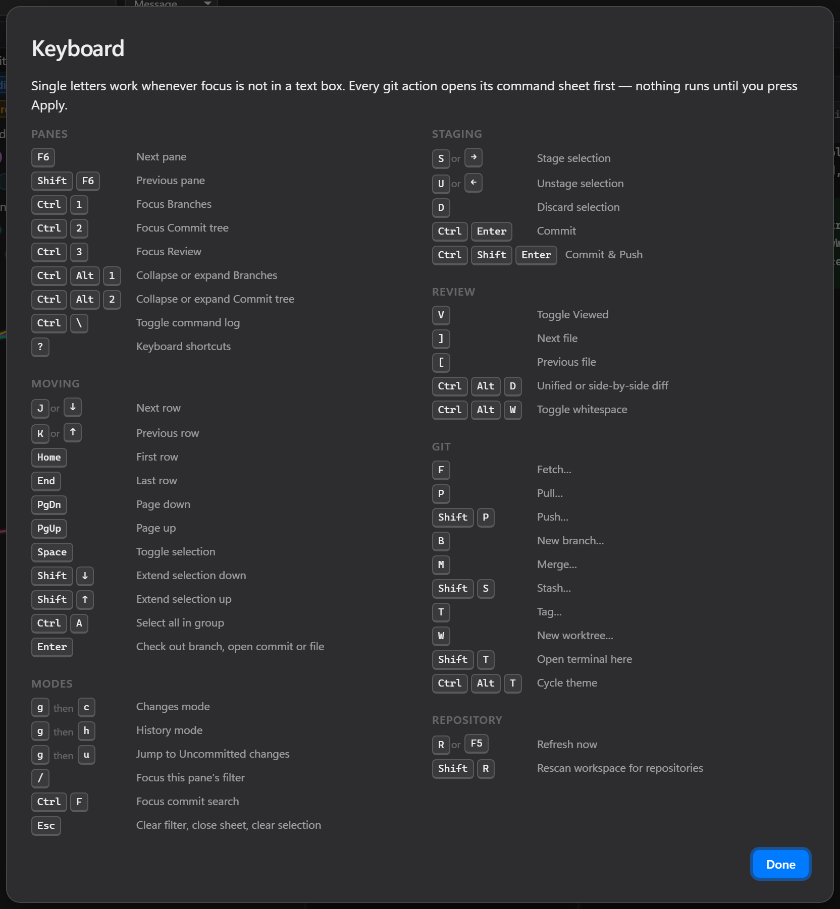

Here's the quick reference:

| Action | Keys |
| --- | --- |
| Move (up/down) | `j` / `k` |
| Select | `Space` |
| Stage / Unstage | `s` / `u` |
| Commit | `Ctrl+Enter` |
| Commit & Push | `Ctrl+Shift+Enter` |
| New worktree | `w` (or `Ctrl+Shift+G W` anywhere in VS Code) |
| Filter refs | `/` |
| Fetch / Pull / Push | `f` / `p` / `Shift+P` |
| Branch / Merge | `b` / `m` |
| Stash | `Shift+S` |
| Changes / History | `g` `c` / `g` `h` |
| Focus pane 1/2/3 | `Ctrl+1` / `Ctrl+2` / `Ctrl+3` |
| Cycle theme | `Ctrl+Alt+T` |

---

## ⚙️ Settings

| Setting | Default | What it does |
| --- | --- | --- |
| `gitTree.git.path` | *(auto)* | Absolute path to your Git binary |
| `gitTree.discovery.maxDepth` | `4` | Folder depth to scan for repositories |
| `gitTree.discovery.excludeGlobs` | `[]` | Extra folder names to skip |
| `gitTree.followActiveEditor` | `true` | Active repo follows the file you're editing |
| `gitTree.autoRefresh` | `true` | Auto-refresh when files change (press `r` to toggle) |
| `gitTree.accentColor` | `#007AFF` | Interface accent color |
| `gitTree.graph.density` | `comfortable` | Commit graph row height |
| `gitTree.dateFormat` | `relative` | How commit dates render (relative/absolute/iso) |
| `gitTree.discovery.extraPaths` | `[]` | Extra folders to scan for repositories and worktrees |
| `gitTree.worktrees.*` | | Worktree location and behaviour — see §14 |

`node_modules`, `dist`, `build`, `target`, `.venv` and similar are skipped automatically.

---

## 🧪 Tested Before Every Release

Every release runs the full test suite first — typechecking plus 700+ tests, including real-git tests
of commits, pushes, worktrees, discards, cherry-picks, reverts, resets, archives and patches. The
`vscode:prepublish` step runs `npm run verify` before building, so a failing test stops a release
before anything is packaged. The same checks run on every push and pull request on GitHub
(Windows and Linux).

```bash
npm run verify    # typecheck + all tests
npm run release   # verify, then publish a patch release
```

## 🔒 Privacy

Git Tree runs **on your machine**. It executes your local Git binary and reads your repositories, and sends **no telemetry or analytics**.

It reaches the network only when you ask it to: **pull requests** talk to GitHub, Azure DevOps, GitLab or
Bitbucket once you sign in, and **✨ AI commit messages** send the staged diff to the language model
*you* have in VS Code (such as GitHub Copilot), only when you click ✨ — VS Code asks your permission the
first time.

---

## 📄 License

Copyright (c) 2026 Javian Picardo Group Inc

Licensed under the MIT License. See the [LICENSE](LICENSE) file for details.

---

## 🔗 Resources

- [**GitHub Repository**](https://github.com/JavianDev/GitTree) — Source code, issues, and contributions
- [**Marketplace**](https://marketplace.visualstudio.com/items?itemName=javian-picardo-group-inc.git-tree) — Install the extension

---

**Made with ❤️ by Javian Picardo**